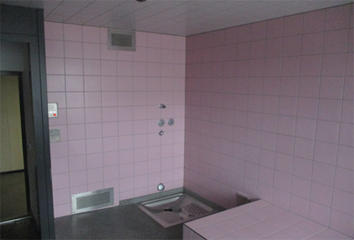
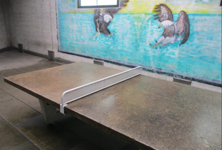

+++
title = "Aus dem Kinderzimmer hinter Gitter"
date = "2023-06-15"
draft = false
pinned = false
tags = ["Jugendgefängnis"]
+++
<!--StartFragment-->

*Minderjährig und gewalttätig - was passiert eigentlich mit straffällig gewordenen Jugendlichen? Ein Einblick ins System eines Schweizer Jugendgefängnisses*  

> Eine Reportage von Tatiana Feuz und Fabia Sinsel 

Ein Aufenthaltsraum mit einer Playstation. Auf dessen Sofa eine mysteriöse Unterhose, die auf Jugendliche hinweist. Direkt daneben Mehrbettzimmer, deren zerkratzte und bemalte Spiegel schon unbrauchbar sind. An der Wand ist der jeweilige Wochenplan zu sehen. Man könnte denken, man befände sich in einem Internat, einem Internat ohne Schule, ohne Wochenende zu Hause, aber einer maximalen Zigarettenausgabe von sechs Stück pro Tag. Zigaretten, die man sich hinter die Ohren klemmt, bevor man dem netten Gefängniswärter auf die Füsse spuckt, ihn beleidigt und zur Strafe in eine Einzelzelle kommt.  

Seit Anfang 2021 gibt es im Regionalgefängnis Thun eine Jugendabteilung für beide Geschlechter, die bis zu zwölf Insassen von zehn bis 18 Jahren aufnimmt und unterstützt. Diese Abteilung ist in das Hauptgebäude integriert.  Dadurch werden Anlagen wie Duschen oder Kraftraum von minder- sowie volljährigen Insassen genutzt. Allerdings strikt getrennt. Das Hauptziel der Jugendabteilung ist es, den Jugendlichen Vernunft beizubringen und vorerst einen strukturierten Alltag sowie später Zugang zu einer einigermassen guten Ausbildung zu ermöglichen.  

Am Eingang erwartet einen zunächst ein Schalter, wo die ID abgegeben werden muss. Im Warteraum hängt ein optimistisches Plakat, darauf „Wir eröffnen straffällig gewordenen Menschen eine Perspektive - für die Sicherheit aller.“ Um in das Gebäude zu gelangen, müssen alle Geräte mit Sendefunktion in den Schliessfächern deponiert werden, da die Sicherheit und der Datenschutz hier eine hohe Priorität haben. Hinter der abgeriegelten Tür findet man sich in einem eintönigen Konstrukt wieder. Grosse Betonblock Wände, vernagelt mit grün-grauen Spanfaserplatten. Frisch verhaftete Angeklagte kommen hier in eine der beiden Untersuchungszellen, in welchen eine Aufnahme der Personalien und Personenkontrolle stattfindet, bis über eine Einweisung entschieden worden ist.  

Im ersten Stock des drei-etagen hohen Gebäudes ist die Jugendabteilung stationiert. Küche, Aufenthaltsraum, Werkraum, Personalbüro und nicht zu vergessen:die Zellen. Mehr Räume als bei den Erwachsenen, die ihre Zeit in einer einzigen Zelle verbringen. Sie haben sogar eine Playstation und einen Computer. Mit einem zusätzlichen Kabel können sie ins Internet, um überwacht nach einer Lehrstelle oder einem Platz im Heim zu suchen. Andrea Zimmermann, Stationsleiterin auf der Jugendabteilung, erzählt uns von der Lehrstellensuche hier: „Eine Lehrstelle zu finden, ist mit einer solchen Vorgeschichte nicht einfach. Unsere Jugendliche bekommen es aber schon etwas auf dem Silbertablett serviert. Ausserhalb vom Gefängnis ist es schliesslich auch schwierig, eine Stelle zu finden.“ Das Stellenangebot sei schon knapp und für einen Kriminellen noch knapper.  

Von den Eltern verstossen, gelange man auf die Strasse, geriete in die falsche Gruppe, werde beeinflusst und lande in der Drogenszene und der Prostitution. In so einer Situation werde man schnell straffällig und es liege ein Grund zur Verhaftung vor. Bei einer Verhaftung sei auch immer die KESB (Kindes- und Erwachsenenschutzbehörde) direkt involviert, dabei sei das Gefängnis tendenziell die letzte Massnahme. Vor einem Aufenthalt stünden meistens schon mehrere erfolglose Versuche in Sozialhilfeeinrichtungen. Wurde jemand beispielsweise vergewaltigt oder hat psychische Traumata erlitten, könne auch eine Psychiatrieeinweisung in Betracht gezogen werden. Für kleinere, temporäre Zusammenbrüche oder Probleme innerhalb der Abteilung stehe eine Psychologin mindestens einmal pro Woche zur Verfügung, erklärt Frau Zimmermann. 

Für Notfälle gibt es auch Disziplinarzellen, welche selbstverletzungssicher sind. In diesem mit pinken Keramikplatten bestückten Raum gibt es keine Fenster, keine richtige Toilette, lediglich eine flache Wanne mit einem Abfluss ohne Vorhang, die auch zum Duschen gedacht ist. Bei guter Führung wird die Zelle mit einem Duschvorhang für mehr Sichtschutz und Privatsphäre ausgestattet. Geschlafen wird auf einem 1.20x 2m grossen Block, worauf eine Matratze platziert werden kann. In dieser Zelle würde man 24 Stunden pro Tag überwacht werden und hätte keine Privatsphäre. In die reguläre Zelle kann man dann erst wieder zurück, wenn man die Wärter überzeugt hat, dass es einem wieder gut geht und man sich nicht selbst verletzt. Ausserdem wird als Essen nur Fingerfood serviert. Besteck würde ein zu hohes Risiko darstellen.  

Die erwachsenen Insassen bekommen ihr Essen aus der Gefängnisküche serviert. In dieser arbeiten ein angestellter Koch und acht Insassen, welche sich durch exzellente Kooperation für diesen beliebten Job qualifizieren konnten. Auf der Jugendstation gibt es eine Gemeinschaftsküche, die viermal pro Woche von den Jugendlichen benutzt wird. Die minderjährigen Insassen suchen Rezepte selbst aus und bekommen die benötigten Zutaten geliefert. Auch Gerichte wie Burger und Pommes oder Pizza können somit auf dem Speiseplan stehen. Es wird allerdings Wert daraufgelegt, so viel wie möglich selbst zuzubereiten. Patties werden geformt, Brioche Buns gebacken und Pommes aus rohen Kartoffeln geschnitten, anstatt die Fertigware zu verwenden. Das Ziel ist es, die Zeit sinnvoll zu nutzen und die Jugendlichen in ihrer Selbstständigkeit zu fördern. Meldet sich niemand zum Kochen, gibt es Brot mit Butter. Die Gefängnisküche ist sofern nicht für die Verpflegung der Jugendabteilung zuständig.  

Jeden Tag bekommen die Jugendlichen 3-5 Franken auf ihr eigenes Gefängniskonto überwiesen. Damit können sie jede Woche Lebensmittel für sich selbst bestellen. Die Lebensmittel werden von einem lokalen eigenständigen Geschäft geliefert. Kleider tragen sie ihre eigenen, einen Dresscode oder gar eine Uniform gibt es nicht. Wer direkt von der Strasse eingewiesen wird, bekommt Trainerhose und Hoodie vom Gefängnis zur Verfügung gestellt.  

Auch Insassen unter 16 Jahren werden Zigaretten ausgehändigt, sofern die erziehungsberechtigte Person dem zustimmt. „Rauchen ist hier unser kleinstes Problem“, lacht Frau Zimmermann, „oftmals ist es ein guter Stressabbau.“ Die Zigaretten können in der eigenen Zelle oder auf dem kleinen Hof, der eher einer Garage mit Ping-Pong Tisch ähnelt, geraucht werden. Die Zellen habe zwar eine Lüftung, Fenster können aber keine geöffnet werden. Da man eine Raucherzelle direkt riecht, wird auf die Trennung von Nichtrauchern und Rauchern geachtet.  

Die Abteilungsleiterin, Andrea Zimmermann, hat Sozialpädagogik in Freiburg studiert und vor der Stelle im Gefängnis in anderen Jugendeinrichtungen gearbeitet. Das Gefängnis eröffnet ihr ein neues interessantes Berufsfeld. Um die strafrechtlichen Komponenten der neuen Stelle besser zu verstehen, studiert sie nebenberuflich momentan Kriminologie. Sie will den Jugendlichen helfen aus dem, wie sie es sagt, “Netz” herauszukommen. Die Jugendlichen sollen lernen, motiviert zu arbeiten und respektvoll zu sein. Dabei äussert sie sich zum Thema ACAB (Ein Aktivismusaudruck; „All cops are bastards“). Sie spricht davon, wie ein junger Mann ihr erzählt habe, dass er in der Jugendabteilung etwas gelernt habe. Er habe gemerkt, Leute gingen mit einem auch anständig und respektvoll um, wenn man selbst mit den Leuten anständig umgeht. Das habe er bei der Polizei probiert und es habe funktioniert. Andrea Zimmermann erläutert genauer: “Natürlich gibt es Polizisten, die ihren Beruf besser durchführen als andere. Jedoch benehmen sich die Jugendlichen und Erwachsene manchmal so schräg, dass sie es selbst nicht einmal merken.”  Was auf jeden Fall schräg ist, ist Menschen auf die Füsse zu spucken. Ausser man will, wie der schon genannte junge Mann, in einer Einzelzelle eingesperrt werden. 

<!--EndFragment-->